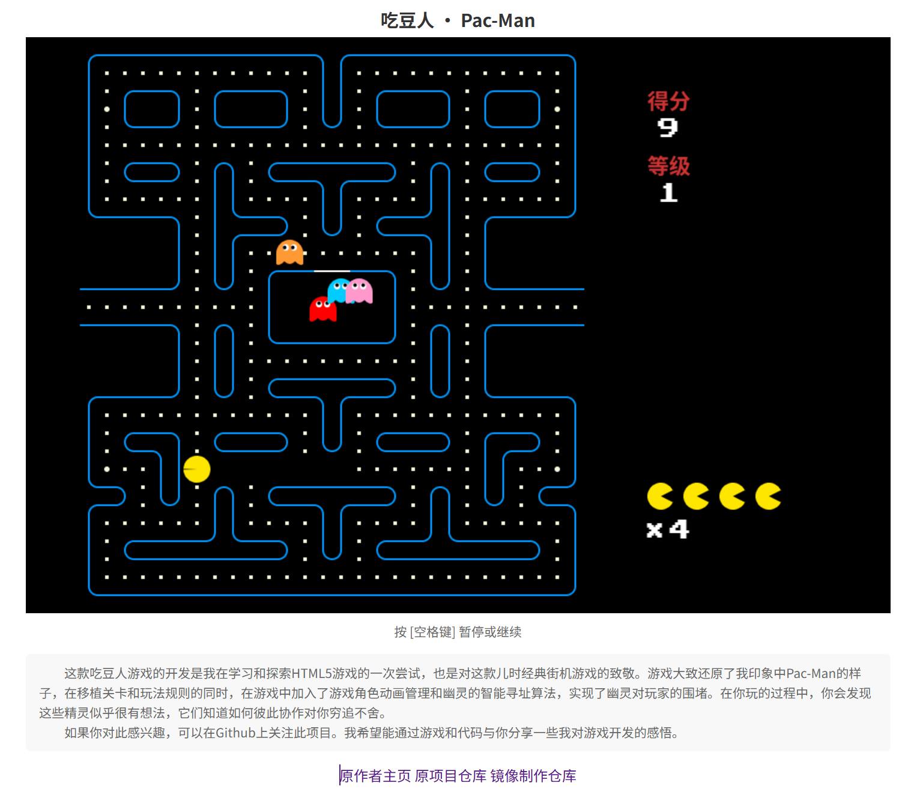

# Pacman 吃豆游戏

- 项目演示(DEMO)地址：https://passer-by.com/pacman/

## 汉化说明

当前汉化仅适用于 版本：

首先感谢原作者的开源。[原项目地址](https://github.com/mumuy/pacman)

具体汉化了那些内容，请参考[翻译说明](./翻译说明.md)。

我看不懂代码，所以只做汉化，有问题，请到原作者仓库处反馈。

本人提供这个项目在 NAS、服务器等的有偿远程部署服务，有需要可联系。  
微信号 `E-0_0-`  
闲鱼搜索用户 `明月人间`  
或者邮箱 `firfe163@163.com`  
如果这个项目有帮到你。欢迎start。

有其他的项目的汉化需求，欢迎提issue。或其他方式联系通知。

### 部署汉化项目

1. 从阿里云或华为云镜像仓库拉取镜像，注意填写镜像标签，镜像仓库中没有`latest`标签

   ```bash
   docker pull swr.cn-north-4.myhuaweicloud.com/firfe/pacman-2:2024.09.24
   ```

2. 部署  
   容器内部端口 3000
     - 命令部署

       ```bash
       docker run -d \
       --name pacman-2 \
       --network bridge \
       --restart always \
       --log-opt max-size=1m \
       --log-opt max-file=3 \
       -p 3000:3000 \
       swr.cn-north-4.myhuaweicloud.com/firfe/pacman-2:2024.09.24
       ```

     - `compose.yaml`文件部署 👍推荐

       ```yaml
       #version: '3.9'
       services:
         pacman-2:
           container_name: pacman-2
           image: swr.cn-north-4.myhuaweicloud.com/firfe/pacman-2:2024.09.24
           network_mode: bridge
           restart: always
           logging:
             options:
               max-size: 1m
               max-file: '3'
           ports:
             - 3000:3000
       ```
## 修改说明

这里对除了汉化之外的代码修改的说明。  
增加修改部分具体见 [修改说明](./修改说明.md)。

`./README.md` 文件翻译，增加 `## 汉化说明`、`## 修改说明`、`## 汉化效果截图` 部分。

增加目录 `./图片`
新增文件 `./.dockerignore`、`./Dockerfile`、`./翻译说明.md`、`./修改说明.md`  

## 汉化效果截图



## 版权
本游戏由 [passer-by.com](https://passer-by.com/) 制作，请尊重作者，引用请注明来源。

功能

- [x] 地图绘制
- [x] 玩家控制
- [x] NPC根据玩家坐标实时自动寻径
- [x] 吃豆积分系统
- [x] 能量豆功能
- [x] 多关卡(共12关)
- [ ] 特殊物品记分
